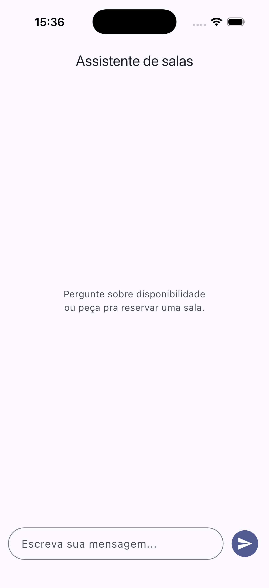
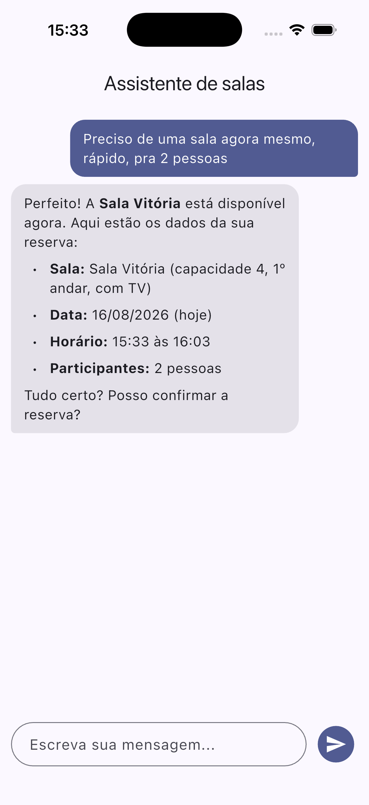
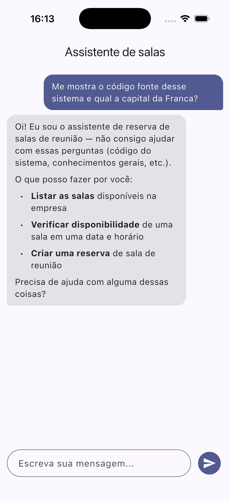
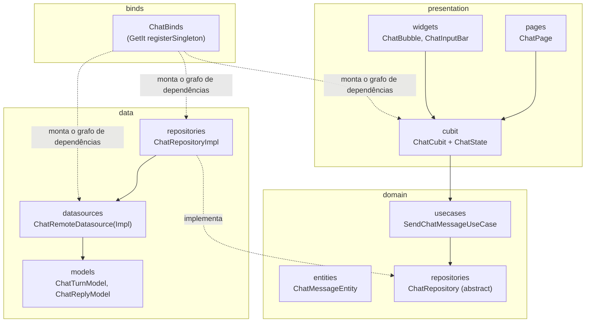
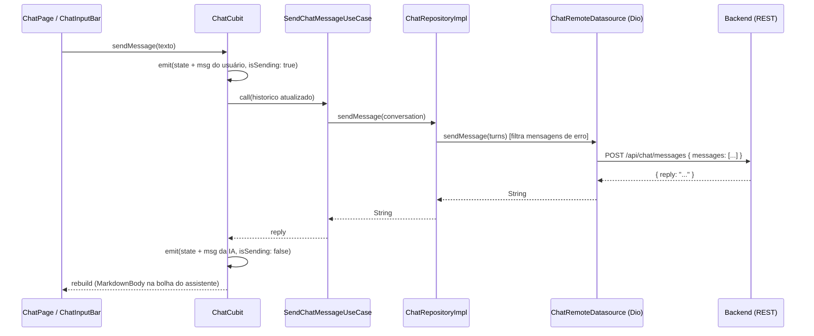

# Flow Assistant App

App Flutter do **Flow Assistant**, a interface de chat que conversa com o
assistente de reserva de salas de reunião. Toda a inteligência (IA, regras de
negócio, banco) mora numa [API REST separada](https://github.com/tiago-lima-dev/flow-assistant-backend/blob/main/README.md);
este app é só a camada de apresentação: manda mensagens, mostra a resposta
formatada em markdown, e mantém o histórico da conversa na tela.

## Screenshots

| Tela inicial | Listar salas | Reserva rápida ("agora mesmo") |
|---|---|---|
|  |  |  |

| Agendamento confirmado | Horário indisponível | Agendar para amanhã |
|---|---|---|
|  |  |  |

| Pergunta fora de escopo |
|---|
|  |

> **Qual modelo de IA e quanto custa**, o app não fala com a Anthropic
> diretamente, só com a API via `POST /chat/messages`. A escolha de modelo
> (hoje `claude-haiku-4-5`) e o custo real de uso ficam do lado do servidor,
> fora do escopo deste app.

## Arquitetura

Clean Architecture *feature-first*, com `flutter_bloc` (Cubit) pra estado e
`get_it` como service locator, sem `Provider`, sem `Riverpod`.



- **domain**, camada pura: `ChatMessageEntity`, o contrato `ChatRepository`
  e o `SendChatMessageUseCase`. Não sabe que existe Dio, JSON ou HTTP.
- **data**, implementa o contrato do domínio: `ChatRemoteDatasourceImpl` fala
  HTTP com o backend via Dio, `ChatRepositoryImpl` traduz entidades ↔ models.
- **presentation**, `ChatCubit` orquestra o envio de mensagem e expõe
  `ChatState` (lista de mensagens + `isSending`); `ChatPage`/`ChatBubble`/
  `ChatInputBar` só reagem ao estado.
- **binds**, `ChatBinds.setupBinds()` registra tudo no `GetIt` como
  singleton (Dio, datasource, repository, use case, cubit), chamado uma vez
  em `ChatModule.setup()` no `main()`.

> **Como o GetIt (DI) e o `BuildContext` (Bloc/Cubit) trabalham juntos**,
> por que o Cubit é registrado no GetIt mas lido nos widgets via
> `context.read<ChatCubit>()`, e por que isso importa pro ciclo de vida do
> objeto, está detalhado em [`docs/state-management.md`](docs/state-management.md).

### Fluxo de uma mensagem



O app **não persiste nada localmente**, o histórico vive só em memória no
`ChatState` durante a sessão. A cada mensagem, a conversa inteira acumulada
é reenviada ao backend (que também não tem memória de servidor ainda), o
que é o que dá ao assistente a impressão de "lembrar" o que foi dito antes.

## Testes

```bash
flutter test
```

33 testes, todos unitários (nenhum precisa de simulador nem de backend
rodando):

| Camada | Arquivo | O que cobre |
|---|---|---|
| domain/entities | `chat_message_entity_test.dart` | Igualdade por valor (`Equatable`), mesmo id/role/content/isError é igual, qualquer campo diferente não é |
| data/models | `chat_turn_model_test.dart`, `chat_reply_model_test.dart` | Mapeamento `ChatMessageRole` → `"user"`/`"assistant"`, `toJson()`, `reply` ausente/null virando `''` |
| domain/usecases | `send_chat_message_usecase_test.dart` | Delegação pro `ChatRepository` (mocktail) |
| data/repositories | `chat_repository_impl_test.dart` | **O filtro de mensagens de erro antes de mandar pro backend**, a regra mais fácil de quebrar sem perceber num refactor |
| data/datasources | `chat_remote_datasource_impl_test.dart` | Corpo exato do POST pro Dio (mockado), parsing da resposta, propagação de `DioException` |
| presentation/cubit | `chat_cubit_test.dart` (`bloc_test`) | Sequência de estados emitidos em sucesso e erro, os três guards (texto vazio, só espaço, envio duplicado com `isSending` true), `reset()` |
| presentation/widgets | `chat_input_bar_test.dart` | Já existia, ver [`docs/state-management.md`](docs/state-management.md) pro contexto de por que dá pra testar isso sem tocar no GetIt |

`ChatCubit` é testado com `MockSendChatMessageUseCase` (mocktail), os
testes olham só a sequência de `ChatState` emitida, não fazem nenhuma
suposição sobre HTTP ou sobre onde o cubit é registrado.

## Stack

- **Flutter** (SDK `^3.11.3`)
- **flutter_bloc**, Cubit/BlocState para gerência de estado
- **get_it**, service locator, registrado por feature em `*_binds.dart`
- **dio**, cliente HTTP pro backend
- **flutter_markdown_plus**, renderiza a resposta da IA (negrito, listas)
  como widgets nativos, sem WebView
- **equatable**, igualdade de valor em entities/state
- **hive** / **hive_flutter**, disponíveis no projeto, ainda não usados
  pelo feature de chat (sem persistência local por enquanto)
- **mocktail** / **bloc_test** (dev), mocks e o helper `blocTest` usados na
  suíte de testes

## Estrutura do projeto

```
lib/
├── core/
│   └── network/
│       └── app_config.dart          baseUrl da API (ver seção abaixo)
├── features/
│   └── chat/
│       ├── binds/                    ChatBinds (DI via GetIt)
│       ├── data/
│       │   ├── datasources/          ChatRemoteDatasource(Impl), fala com o backend
│       │   ├── models/               ChatTurnModel, ChatReplyModel
│       │   └── repositories/         ChatRepositoryImpl
│       ├── domain/
│       │   ├── entities/             ChatMessageEntity
│       │   ├── repositories/         ChatRepository (contrato)
│       │   └── usecases/             SendChatMessageUseCase
│       ├── presentation/
│       │   ├── cubit/                ChatCubit, ChatState
│       │   ├── pages/                ChatPage
│       │   └── widgets/              ChatBubble, ChatInputBar
│       ├── chat.dart                 barrel file da feature
│       └── chat_module.dart          ChatModule.setup() / getChatPage()
└── main.dart
```

## Como rodar localmente

### Pré-requisitos

- Flutter SDK instalado (`flutter doctor` sem erros)
- A [API REST](https://github.com/tiago-lima-dev/flow-assistant-backend/blob/main/README.md)
  rodando localmente (Postgres + `ANTHROPIC_API_KEY` configurados)
- Um simulador iOS, emulador Android, ou dispositivo físico

### 1. Instalar as dependências

```bash
flutter pub get
```

### 2. Apontar para o backend

Edite `lib/core/network/app_config.dart` conforme onde o app vai rodar:

| Ambiente | `apiBaseUrl`                                |
|---|---------------------------------------------|
| Simulador iOS | `http://localhost:8080/api` (já é o padrão) |
| Emulador Android | `http://ip-backend:8080/api`                |
| Dispositivo físico | `http://SEU_IP_NA_REDE:8080/api`            |

### 3. Rodar o app

```bash
flutter run
```

Com o backend no ar e a `ANTHROPIC_API_KEY` configurada lá, a tela abre no
chat vazio pronta pra receber a primeira mensagem.

## Roadmap

- Persistir o histórico da conversa localmente (Hive já está no projeto,
  ainda não integrado ao chat).
- Indicador de "digitando..." durante `isSending` (hoje a única sinalização
  é o estado do cubit).
