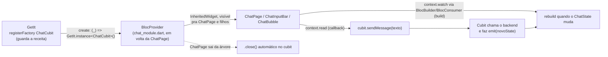

# Bloc/Cubit + GetIt + BuildContext, como as três peças se encaixam

Esse doc explica um ponto que costuma confundir quem tá vendo `flutter_bloc` +
`get_it` juntos pela primeira vez: por que a gente registra o `ChatCubit` no
GetIt, mas em vez de usar `getIt<ChatCubit>()` direto nos widgets, a gente
passa por um `BlocProvider` e lê via `context.read<ChatCubit>()`?

A resposta curta: **GetIt decide quem cria e é dono do objeto. O
`BuildContext` decide quem tem permissão de enxergá-lo, e por quanto tempo.**
São dois problemas diferentes, e cada ferramenta resolve um.

## As duas perguntas que esse padrão separa

1. **"Quem cria o `ChatCubit` e quando ele morre?"** → responsabilidade do
   **GetIt**.
2. **"Quem, na árvore de widgets, pode acessar esse `ChatCubit` agora?"** →
   responsabilidade do **`BuildContext` / `BlocProvider`**.

Se você resolve as duas perguntas com a mesma ferramenta (por exemplo,
chamando `getIt<ChatCubit>()` direto de dentro de qualquer widget), elas
ficam acopladas, e é exatamente esse acoplamento que gera bug difícil de
achar depois, como vamos ver.

## Passo 1, GetIt sabe *como* criar o Cubit

Em [`chat_binds.dart`](../lib/features/chat/binds/chat_binds.dart):

```dart
getIt.registerFactory<ChatCubit>(() => ChatCubit(sendChatMessageUseCase: getIt()));
```

`registerFactory` (diferente de `registerSingleton`) não cria o objeto na
hora do registro, ele guarda **a receita** pra criar um. Toda vez que
alguém chamar `getIt<ChatCubit>()`, o GetIt roda essa receita de novo e
devolve uma **instância nova**. Isso roda uma vez, em `ChatModule.setup()`,
antes do `runApp()`, mas nesse ponto nenhum `ChatCubit` existe ainda,
só a receita pra fazer um.

## Passo 2, o `BlocProvider` decide *quando* criar e destruir

Em [`chat_module.dart`](../lib/features/chat/chat_module.dart):

```dart
static Widget getChatPage() => BlocProvider<ChatCubit>(
      create: (_) => GetIt.instance<ChatCubit>(),
      child: const ChatPage(),
    );
```

Isso substitui o antigo `BlocProvider<ChatCubit>.value(...)` que ficava no
`main.dart`, publicando o cubit pra árvore inteira do app (veja a seção
"Antes vs Depois" mais abaixo pra comparar as duas versões lado a lado).

Aqui, `BlocProvider` **cria** o `ChatCubit` (chamando a factory do GetIt) na
primeira vez que `getChatPage()` monta, e **é dono dele** a partir daí, não
o GetIt. Isso importa pra decidir qual construtor usar:

| Construtor | Quem é dono do objeto | O que acontece quando esse trecho da árvore some |
|---|---|---|
| `BlocProvider(create: (_) => Cubit())` | O `BlocProvider` | Ele chama `.close()` no cubit automaticamente |
| `BlocProvider.value(value: cubit)` | Quem passou o `value` | Ele **não** fecha o cubit, só para de expô-lo |

Como agora o GetIt só guarda uma *receita* (factory), não uma instância
compartilhada, usar `create:` é o certo: o `BlocProvider` chama
`GetIt.instance<ChatCubit>()` (que roda a receita e devolve um `ChatCubit`
novinho), assume a posse dele, e vai fechá-lo (`.close()`) automaticamente
quando esse trecho da árvore for desmontado, sem vazar nem deixar Stream
aberta pra trás. Se ainda fosse `registerSingleton` + `.value`, `create:`
seria um bug (fecharia o único cubit compartilhado); com `registerFactory` +
`create:`, é exatamente o comportamento certo.

## Passo 3, os widgets leem o Cubit através do `context`

Em [`chat_input_bar.dart`](../lib/features/chat/presentation/widgets/chat_input_bar.dart):

```dart
void _send() {
  final text = _controller.text;
  if (text.trim().isEmpty) return;
  context.read<ChatCubit>().sendMessage(text);
  _controller.clear();
}
```

`context.read<ChatCubit>()` faz o `BuildContext` **subir pela árvore de
widgets** a partir do widget atual até achar o `BlocProvider<ChatCubit>`
mais próximo (o que registramos no `main.dart`), e devolve a instância que
ele guarda. É basicamente:

> "a partir de onde eu estou na árvore agora, me dá o `ChatCubit` visível
> daqui."

`read` faz essa busca **uma vez, na hora da chamada**, e não inscreve o
widget pra rebuildar quando o estado do cubit mudar. Por isso ele é o
correto dentro de `_send()`, um *event handler* (reação a um toque de
botão), não uma leitura reativa de UI. Se você usasse `context.watch<ChatCubit>()`
aqui dentro, o Flutter reclamaria, `watch` só pode ser chamado dentro de
`build()`.

Isso é o par de `read` na prática: no mesmo arquivo, o `build()` usa
`BlocBuilder<ChatCubit, ChatState>` (que por baixo é um `context.watch`) pra
reconstruir o botão de enviar quando `state.isSending` muda:

```dart
BlocBuilder<ChatCubit, ChatState>(
  buildWhen: (previous, current) => previous.isSending != current.isSending,
  builder: (context, state) { ... },
);
```

### Regra prática: `read` em callback, `watch`/`Bloc*` em `build()`

| Onde | O que usar | Por quê |
|---|---|---|
| Dentro de `build()`, pra desenhar UI que reage ao estado | `context.watch<T>()` ou `BlocBuilder`/`BlocConsumer` | Precisa inscrever o widget pra rebuildar quando o estado mudar |
| Dentro de um callback (`onPressed`, `onSubmitted`, etc.) | `context.read<T>()` | É uma ação pontual, não queremos rebuild, só chamar um método |

## Por que ler via `context` em vez de `getIt<ChatCubit>()` direto

Esse é o ponto central: **tecnicamente**,
hoje, `context.read<ChatCubit>()` e `getIt<ChatCubit>()` devolvem exatamente
o mesmo objeto (porque o `ChatCubit` é um singleton). Então por que não
simplificar e chamar `getIt<ChatCubit>()` direto do widget, sem passar pelo
`BlocProvider`?

Porque as duas formas de acesso têm ciclos de vida diferentes:

- **`getIt<T>()`** enxerga o objeto **globalmente**, o tempo todo, não importa
  se o widget que está chamando ainda existe na tela ou não. Ele não sabe
  nada sobre árvore de widgets.
- **`context.read<T>()`** só enxerga o objeto **enquanto aquele `BuildContext`
  estiver montado dentro do escopo onde o `BlocProvider` foi declarado**. Se o
  widget morre (é removido da árvore), aquele `context` morre junto, e
  qualquer tentativa de usá-lo depois falha imediatamente e de forma clara
  (o Flutter lança um erro explícito), em vez de silenciosamente continuar
  operando em cima de algo que já deveria ter sido descartado.

Na prática isso significa três coisas concretas:

1. **Segurança de ciclo de vida.** Se um `await` dentro de um método assíncrono
   terminar depois que o widget já foi desmontado (usuário saiu da tela no
   meio do processo), usar `context.read` te avisa na hora, o erro aparece
   no ato. Usar `getIt<T>()` não te avisa de nada: o objeto ainda existe
   globalmente, então o código continua rodando "normalmente" em cima de um
   estado que não deveria mais importar pra ninguém.

2. **Escopo, não só existência global.** O `ChatCubit` já foi um singleton
   (vivia o app inteiro) e virou um cubit *por tela*, escopado à `ChatPage`
   (veja "Antes vs Depois" abaixo). Essa troca não exigiu mudar **nenhum**
   widget em `presentation/`, porque eles nunca dependeram do GetIt
   diretamente, só do "`ChatCubit` mais próximo na árvore". Se algum widget
   chamasse `getIt<ChatCubit>()` direto, ele continuaria compilando depois da
   troca, mas passaria a devolver uma instância *nova e desconectada* a cada
   chamada (porque agora é `registerFactory`, não `registerSingleton`), um
   bug silencioso, sem erro nenhum avisando.

3. **Testabilidade.** Pra testar `ChatInputBar` isolado, basta envolver ele
   num `BlocProvider<ChatCubit>.value(value: fakeCubit)` de teste, não
   precisa configurar nem resetar o GetIt entre testes. Se o widget lesse
   `getIt<ChatCubit>()` direto, cada teste teria que registrar e desregistrar
   o GetIt manualmente, com risco real de um teste vazar estado pro próximo.

Resumindo: **GetIt resolve "onde o objeto nasce e
quem é dono dele". `BuildContext`/`BlocProvider` resolve "quem, olhando pra
árvore agora, tem permissão de usá-lo, e até quando".** Usar `context.read`
em vez de `getIt` direto nos widgets é abrir mão de um atalho que funciona
hoje, em troca de uma garantia que evita bug de ciclo de vida amanhã.

## O fluxo completo, de ponta a ponta



## Glossário, `read` vs `watch` vs `select`, e os três widgets `Bloc*`

### `context.read<T>()`

Busca a instância uma vez, na hora da chamada, e não inscreve nada pra
rebuild. Uso: dentro de callbacks (`onPressed`, `onSubmitted`, `initState`,
métodos assíncronos), qualquer lugar que não seja o `build()`.

```dart
onPressed: () => context.read<ChatCubit>().sendMessage(texto),
```

### `context.watch<T>()`

Também busca a instância, mas **inscreve o widget atual pra rebuildar**
toda vez que o `ChatState` mudar. Só pode ser chamado dentro de `build()`,
chamar em outro lugar (callback, `initState`) lança erro em tempo de
execução, porque fora do `build()` não existe rebuild pra disparar.

```dart
@override
Widget build(BuildContext context) {
  final state = context.watch<ChatCubit>().state; // rebuilda a cada emit()
  return Text(state.isSending ? 'Enviando...' : 'Pronto');
}
```

Na prática, esse projeto não usa `context.watch` diretamente, usa
`BlocBuilder`/`BlocConsumer`, que fazem a mesma coisa por baixo dos panos
mas com mais controle sobre *quando* rebuildar (veja abaixo).

### `context.select<T, R>(selector)`

Uma versão mais cirúrgica do `watch`: rebuilda o widget só quando o
**pedaço específico** do estado que o `selector` extrai muda, ignorando o
resto. Útil quando o `ChatState` tem vários campos e o widget só se importa
com um deles.

```dart
final isSending = context.select<ChatCubit, bool>((cubit) => cubit.state.isSending);
```

Esse projeto ainda não precisa disso, o `buildWhen`/`listenWhen` dos
widgets `Bloc*` (próxima seção) já resolve o mesmo problema pros dois casos
que existem hoje (`ChatPage` e `ChatInputBar`).

### `BlocBuilder` vs `BlocListener` vs `BlocConsumer`

Os três são açúcar sintático em cima de `context.watch` + `InheritedWidget`,
cada um pra um propósito:

| Widget | Pra que serve | Exemplo no projeto |
|---|---|---|
| `BlocBuilder<C, S>` | Reconstruir UI em reação ao estado | `ChatInputBar`, troca o ícone de enviar por um spinner quando `isSending` muda |
| `BlocListener<C, S>` | Rodar um efeito colateral (sem rebuildar UI), navegação, snackbar, etc. | Não usado ainda neste projeto |
| `BlocConsumer<C, S>` | `BlocBuilder` + `BlocListener` juntos, quando você precisa das duas coisas ao mesmo tempo | `ChatPage`, reconstrói a lista de mensagens (`builder`) *e* rola a tela pro fim (`listener`) quando uma mensagem nova chega |

O `buildWhen`/`listenWhen` de cada um é o que evita rebuild desnecessário,
por exemplo, em `chat_input_bar.dart`:

```dart
BlocBuilder<ChatCubit, ChatState>(
  buildWhen: (previous, current) => previous.isSending != current.isSending,
  builder: (context, state) { ... },
);
```

Isso diz: "só reconstrua esse widget quando `isSending` mudar de valor",
uma nova mensagem chegando não dispara rebuild aqui, porque quem cuida da
lista de mensagens é o `BlocConsumer` da `ChatPage`, não o input bar.

## Antes vs Depois, de singleton global pra cubit escopado

O projeto começou com o `ChatCubit` como singleton do GetIt, publicado pra
árvore inteira do app via `BlocProvider.value` no `main.dart`. Foi trocado
pelo padrão descrito nos Passos 1 e 2 acima. As duas versões:

**Antes**, `chat_binds.dart` criava o cubit na hora do registro e o GetIt
segurava essa única instância:

```dart
getIt.registerSingleton<ChatCubit>(ChatCubit(sendChatMessageUseCase: getIt()));
```

`main.dart` publicava esse singleton pra árvore inteira, acima do
`MaterialApp`:

```dart
return MultiBlocProvider(
  providers: [BlocProvider<ChatCubit>.value(value: getIt<ChatCubit>())],
  child: MaterialApp(..., home: ChatModule.getChatPage()),
);
```

**Depois**, `chat_binds.dart` guarda só a receita:

```dart
getIt.registerFactory<ChatCubit>(() => ChatCubit(sendChatMessageUseCase: getIt()));
```

E quem decide quando essa receita roda, e quando o cubit resultante morre,
é o `BlocProvider`, escopado só à página do chat, dentro de
`chat_module.dart`:

```dart
static Widget getChatPage() => BlocProvider<ChatCubit>(
      create: (_) => GetIt.instance<ChatCubit>(),
      child: const ChatPage(),
    );
```

`main.dart` não sabe mais que o `ChatCubit` existe, só monta o
`MaterialApp` com `home: ChatModule.getChatPage()`.

### Isso muda alguma coisa que dá pra ver na tela?

**Não, hoje não.** Esse app só tem uma tela (`ChatPage`, direto no `home:` do
`MaterialApp`), montada uma vez no início e nunca desmontada, não existe
navegação pra sair e voltar. Então "cubit por tela" e "cubit singleton"
resultam exatamente no mesmo comportamento observável: um `ChatCubit`,
criado uma vez, vivo pelo tempo que o app roda.

### Então por que trocar?

Porque o valor do padrão não é o comportamento de hoje, é **o que ele evita
no dia em que o app ganhar uma segunda tela** (histórico de conversas,
configurações, uma tab de "Minhas Reservas" etc.). Com o `ChatCubit`
escopado à `ChatPage`:

- Sair do chat e voltar cria uma conversa nova por padrão (o cubit antigo
  é fechado, um novo nasce), que costuma ser o comportamento certo pra
  telas de chat efêmero, ao contrário de um singleton que arrastaria o
  histórico de sessões antigas pra sempre.
- Nenhum outro cubit futuro herda acidentalmente estado do `ChatCubit` só
  por ele ainda estar vivo no GetIt.
- O padrão fica consistente: **toda** feature nova segue "GetIt registra a
  receita, `BlocProvider` decide o ciclo de vida", sem precisar lembrar
  caso a caso se aquele cubit em especial "é singleton" ou não.

O trade-off é reconhecer que hoje essa mudança é só arquitetural, não
resolve nenhum bug existente, porque o bug que ela evita (estado vazando
entre visitas a uma tela) só passa a ser possível quando existir mais de uma
tela pra visitar.

## Ver também

- [`test/features/chat/presentation/widgets/chat_input_bar_test.dart`](../test/features/chat/presentation/widgets/chat_input_bar_test.dart):
  o teste de widget citado no ponto 3 acima, usando `MockCubit` (do
  pacote `bloc_test`) + `BlocProvider.value`, sem tocar no GetIt.
